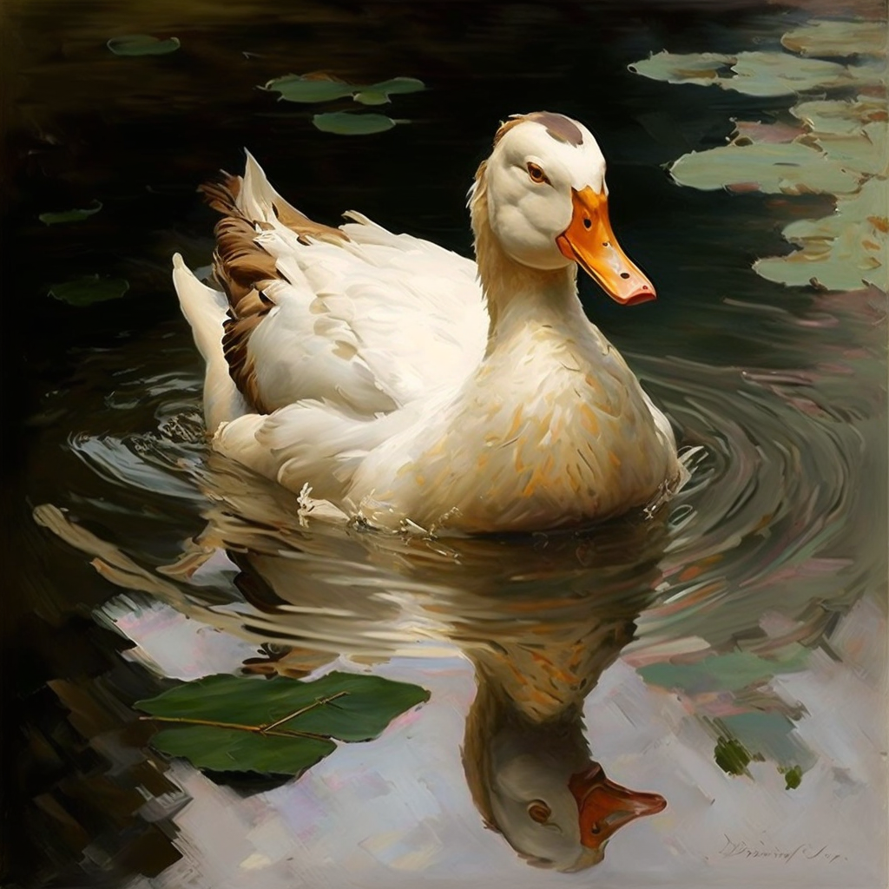
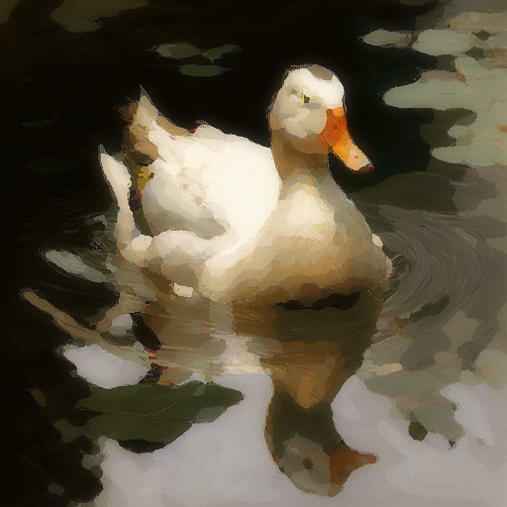

# dygen
Post processing tool.

## Pre-requisite

You will need following Python libraries installed:

PIL and tqdm
These commands should help:
```
pip install 
pip install Pillow
```

# Use

Run
```
python dygen.py
``` 
and you'll get images in the /out folder.

The script currently turns this image:


into this:


# How to do this with your own images:

1. Place an image in a ref folder. Make sure it's a .png!
2. Open dygen.py and change ```init_file = "ref"```, where ```ref``` is the name of your file without extension. I.e. if your file is named ```artwork.png```, change the line to ```init_file = "artwork"```

3. Run the script with ```python dygen.py``` 
4. You'll get three new files in /out folder named 
  - artwork.blobs.v1.png - raw color blobs
  - artwork.painted.v1.png - finished painting
  - artwork.sharpened.v1.png - a sharper looking version of the painting

# How to be more creative.

Open dygen.py and start messing up with parameters. They're at the top of the file and I tried to document them as much as possible. Play with different numbers, like ```cluster``` and ```color_count``` and see what you get.

# Advanced 

The fun start when you start using your own stencil masks. In /tex folder I placed two files that are currently used in the painting process, if you edit those, you'll get a much different look. Think of them as brushes. Worse comes to worse - hit me up on Twitter @dymokomi
